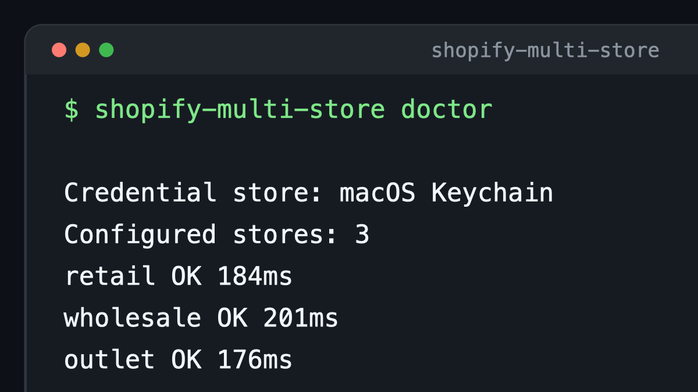

<div align="center">

# Shopify Multi-Store MCP

### One MCP server. Every Shopify store.

Query, compare, report, and make guarded updates across Shopify stores from Claude, Codex, Cursor, VS Code, and other MCP clients.


[](https://github.com/alex-brecher/shopify-multi-store/actions/workflows/ci.yml)
[](https://www.npmjs.com/package/shopify-multi-store-mcp-server)
[](https://registry.npmjs.org/-/npm/v1/attestations/shopify-multi-store-mcp-server@1.5.0)
[](package.json)
[](https://modelcontextprotocol.io/)
[](LICENSE)

[Demo](#see-it-work) · [Quick start](#quick-start) · [Reports](#ready-made-reports) · [AI clients](#connect-an-ai-client) · [Security](#security-model)

</div>

## See it work



The demonstration uses sample stores and sample data. The server keeps each real store credential separate.

## Quick start

Install the server, connect your stores, and run the health check:

```bash
npm install --global shopify-multi-store-mcp-server
shopify-multi-store setup
shopify-multi-store doctor
```

Claude Code users can add the server with one command:

```bash
claude mcp add shopify-multi-store -- npx -y shopify-multi-store-mcp-server start
```

Each store gets a permanent alias and a separate secure credential. Every store operation requires that alias.

## What you get

| Capability | Result |
| --- | --- |
| Multiple active stores | Keep every Shopify store available in one AI conversation. |
| Cross-store reports | Search products, compare catalogs, find stock gaps, and report fulfillment SLA breaches. |
| Parallel GraphQL | Run one read-only query across up to ten stores. |
| Guarded mutations | Target one store and pass an explicit confirmation for each update. |
| Secure credentials | Use macOS Keychain, Windows Credential Manager, or Linux Secret Service. |
| Portable skills | Guide Claude, Codex, Cursor, and other compatible agents. |

## This server and Shopify Dev MCP

The two servers solve different problems. Use both when an agent needs Shopify reference material and access to your stores.

| Capability | Shopify Multi-Store MCP | [Shopify Dev MCP](https://shopify.dev/docs/apps/build/ai-toolkit#install-with-the-dev-mcp-server) |
| --- | --- | --- |
| Primary purpose | Operate connected Shopify Admin stores. | Search Shopify developer resources. |
| Store data | Read and compare configured stores. | Does not connect to Shopify Admin store data. |
| Multiple stores | Keep named stores active in one session. | Not designed for store portfolio operations. |
| Reports | Provide ready-made operations and catalog reports. | Provide developer documentation and API schemas. |
| Updates | Run guarded mutations against one selected store. | Does not run Admin API updates against your stores. |
| Authentication | Use separate credentials for each store. | Needs no authentication. |

Shopify Dev MCP helps an agent create and examine Shopify code. This server runs the approved operation against the selected store.

## Ready-made reports

| Tool | Purpose |
| --- | --- |
| `shopify_portfolio_snapshot` | Summarize products, orders, customers, currency, plan, and store identity. |
| `shopify_order_summary` | Summarize order values, discounts, tax, shipping, cancellations, and statuses. |
| `shopify_customer_growth` | Compare new-customer counts across equal periods. |
| `shopify_get_product_everywhere` | Find one exact SKU or handle across stores. |
| `shopify_search_products_many` | Search products across stores with one query. |
| `shopify_compare_inventory` | Compare inventory quantities for selected SKUs across stores. |
| `shopify_low_stock_report` | Find low inventory and cross-store transfer opportunities. |
| `shopify_compare_prices` | Highlight price and compare-at-price differences for exact SKUs. |
| `shopify_duplicate_sku_report` | Find repeated SKUs inside stores and shared SKUs across stores. |
| `shopify_list_unfulfilled_orders` | List open fulfillment work across selected stores. |
| `shopify_fulfillment_sla_report` | Find late unfulfilled orders and show age buckets. |
| `shopify_compare_catalog` | Compare products by handle, status, vendor, type, and variants. |
| `shopify_catalog_gap_report` | Find products that are missing or have different statuses. |
| `shopify_catalog_health` | Find missing merchandising, SEO, media, alt text, and inventory data. |
| `shopify_recent_product_changes` | List products updated during a selected period. |
| `shopify_compare_collections` | Compare collection content and configuration by handle. |
| `shopify_store_locations` | Review location, fulfillment, inventory, and address coverage. |

Try prompts like these:

- “Give me a portfolio snapshot for every connected store.”
- “Summarize orders and current order values for the last 30 days. Keep currencies separate.”
- “Show low, zero, and negative inventory across retail and wholesale.”
- “Show products that are out of stock here but available in another store.”
- “Find SKU A123 across every store and compare its status, price, and inventory.”
- “Search every store for products related to protein.”
- “Show unfulfilled orders older than two days, grouped by age.”
- “Find products that are active in one store but missing or draft in another.”
- “Find price differences and duplicate SKUs across these stores.”
- “Compare inventory for SKU A123 and B456 across retail and wholesale.”
- “List unfulfilled orders from the last seven days in three stores.”
- “Audit catalog health and show the products with missing SEO or media data.”
- “Compare the active catalog and featured collections across these stores.”

## Connect an AI client

The server works in clients that support local stdio MCP servers. Agent Skills improve tool selection when the client supports them.

<details>
<summary><strong>Claude Code</strong></summary>

Add the MCP server:

```bash
claude mcp add shopify-multi-store -- npx -y shopify-multi-store-mcp-server start
```

Copy the included skill for personal use:

```bash
mkdir -p ~/.claude/skills/shopify-multi-store
cp .claude/skills/shopify-multi-store/SKILL.md ~/.claude/skills/shopify-multi-store/SKILL.md
```

Claude Code also discovers `.claude/skills` inside this repository.

</details>

<details>
<summary><strong>Claude Desktop and Cursor</strong></summary>

Add this server to the client's MCP configuration:

```json
{
  "mcpServers": {
    "shopify-multi-store": {
      "command": "npx",
      "args": ["-y", "shopify-multi-store-mcp-server", "start"]
    }
  }
}
```

</details>

<details>
<summary><strong>VS Code</strong></summary>

Add this server to `.vscode/mcp.json`:

```json
{
  "servers": {
    "shopify-multi-store": {
      "type": "stdio",
      "command": "npx",
      "args": ["-y", "shopify-multi-store-mcp-server", "start"]
    }
  }
}
```

</details>

<details>
<summary><strong>Other LLM clients</strong></summary>

Use `npx` as the command and `-y shopify-multi-store-mcp-server start` as the arguments.

Copy `skills/shopify-multi-store/SKILL.md` into the client's skills directory when supported. Clients without skill support still get every MCP tool.

</details>

## Store authentication

| Method | Command | Best fit |
| --- | --- | --- |
| Admin API access token | `shopify-multi-store setup` | An existing Shopify admin-created app and token. |
| Client credentials | `shopify-multi-store oauth` | Stores in the same organization as the app. |
| Authorization code | `shopify-multi-store oauth` | Standalone app installations. |

Authorization code setup uses `http://127.0.0.1:3456/oauth/callback`. Add it as an allowed redirect URL first.

The default authorization code scopes are read-only. Grant only the Admin API scopes required for the task.

### Manage stores

```bash
shopify-multi-store list
shopify-multi-store doctor
shopify-multi-store remove store-alias
```

<details>
<summary><strong>Import an existing stores.json file</strong></summary>

```bash
shopify-multi-store import /absolute/path/to/stores.json
```

The import copies credentials into the operating system credential store and preserves configured stores. Delete the old credential file after checking the import.

</details>

## MCP tools

| Tool | Action |
| --- | --- |
| `shopify_list_stores` | List configured store aliases. |
| `shopify_get_shop_info` | Read one store's identity. |
| `shopify_portfolio_snapshot` | Create a cross-store summary. |
| `shopify_order_summary` | Summarize recent orders and monetary totals by currency. |
| `shopify_customer_growth` | Compare new-customer counts across equal periods. |
| `shopify_get_product_everywhere` | Find one exact SKU or handle across stores. |
| `shopify_search_products_many` | Search products across selected stores. |
| `shopify_compare_inventory` | Compare SKU inventory. |
| `shopify_low_stock_report` | Find low inventory and transfer opportunities. |
| `shopify_compare_prices` | Compare exact SKU prices. |
| `shopify_duplicate_sku_report` | Find duplicate and shared SKUs. |
| `shopify_list_unfulfilled_orders` | Report fulfillment work. |
| `shopify_fulfillment_sla_report` | Report order age and SLA breaches. |
| `shopify_compare_catalog` | Compare product catalogs. |
| `shopify_catalog_gap_report` | Find missing products and status differences. |
| `shopify_catalog_health` | Audit product merchandising and SEO data. |
| `shopify_recent_product_changes` | List recently updated products. |
| `shopify_compare_collections` | Compare collections by handle. |
| `shopify_store_locations` | Review store location coverage. |
| `shopify_graphql_query` | Run a read-only Admin GraphQL query. |
| `shopify_graphql_query_many` | Run one query across up to ten stores. |
| `shopify_graphql_mutation` | Change one store after exact authorization. |

Read-only operations can run in parallel. Mutations stay isolated to one selected store.

## Shopify companion skills

Install Shopify's official Admin GraphQL and ShopifyQL skills:

```bash
shopify-multi-store install-shopify-skills
```

The command installs both skills for supported agents. Pass `--agent <name>` to select one agent.

The skills search Shopify documentation and check custom GraphQL operations. ShopifyQL adds sales, revenue, order, conversion, and trend analysis.

This server still controls store selection, credentials, execution, and mutation authorization. Shopify's skill scripts send usage telemetry by default.

Set `OPT_OUT_INSTRUMENTATION=true` to turn off that telemetry.

This integration uses the official [Shopify AI Toolkit](https://github.com/Shopify/Shopify-AI-Toolkit). It also reflects useful patterns from [Shopify Admin Skills](https://github.com/40rty-ai/shopify-admin-skills).

## Security model

Secrets never enter the main configuration file.

| Platform | Credential backend |
| --- | --- |
| macOS | Keychain |
| Windows | Credential Manager |
| Linux | Secret Service |

The configuration stores aliases, domains, API versions, and non-secret OAuth client IDs. Its default path is `~/.config/codex-shopify-multi-store/stores.json`.

Set `SHOPIFY_MULTI_STORE_CONFIG` to use another configuration path.

- Never commit access tokens, OAuth client secrets, `.env` files, or credential-bearing configuration files.
- Grant only the Shopify Admin API scopes required for the task.
- Confirm the target store before every mutation.
- Read [SECURITY.md](SECURITY.md) for vulnerability reporting.

Linux credential storage requires a Secret Service provider, such as GNOME Keyring or KWallet.

## Other installation options

Run a health check without a global install:

```bash
npx -y shopify-multi-store-mcp-server doctor
```

Install directly from GitHub:

```bash
npm install --global github:alex-brecher/shopify-multi-store
```

## Development

```bash
git clone https://github.com/alex-brecher/shopify-multi-store.git
cd shopify-multi-store
npm ci
npm test
npm run test:live
npm pack --dry-run
```

The live test uses configured stores and performs read-only Shopify Admin API calls.

## License

MIT

Read the [changelog](CHANGELOG.md), [contribution guide](CONTRIBUTING.md), [security policy](SECURITY.md), and [directory submission guide](docs/DIRECTORY-SUBMISSIONS.md).
