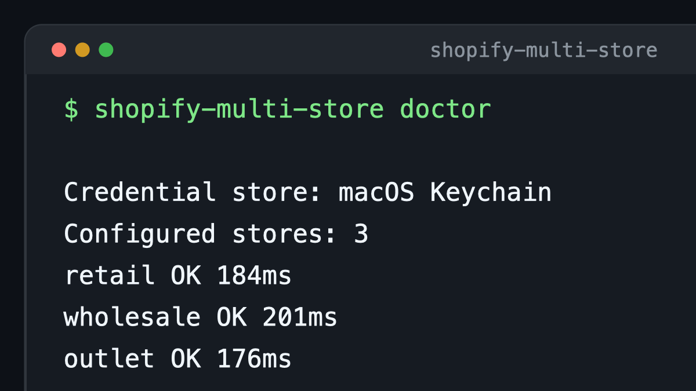

<div align="center">

# Shopify Multi-Store MCP

### One MCP server. Every Shopify store.

Query, compare, report, and make guarded updates across Shopify stores from Claude, ChatGPT, Codex, Cursor, VS Code, and other MCP clients.


[](https://github.com/alex-brecher/shopify-multi-store/actions/workflows/ci.yml)
[](https://www.npmjs.com/package/shopify-multi-store-mcp-server)
[](https://www.npmjs.com/package/shopify-multi-store-mcp-server#provenance)
[](package.json)
[](https://modelcontextprotocol.io/)
[](LICENSE)

[Demo](#see-it-work) · [Quick start](#quick-start) · [Reports](#ready-made-reports) · [AI clients](#connect-an-ai-client) · [Security](#security-model)

</div>

## Version 2.0

Run it locally, or host one server for your team: everyone signs in with their own Shopify staff account and connects from Claude, ChatGPT, Codex or any remote MCP client, with Shopify's own staff permissions deciding what each person can do. Guided Admin workflows, ShopifyQL reports, schema validation, and a generic action surface for any Admin mutation are included.
See [feature coverage and acceptance requirements](docs/PARITY.md).
Full Shopify ChatGPT parity is not yet verified.

## See it work



The demonstration uses sample stores and sample data. The server keeps each real store credential separate.

## Quick start

Install the server, connect your stores, and run the health check:

```bash
npm install --global shopify-multi-store-mcp-server
shopify-multi-store setup
shopify-multi-store doctor
```

Claude Code users can add the server with one command:

```bash
claude mcp add shopify-multi-store -- npx -y shopify-multi-store-mcp-server start
```

Each store gets a permanent alias and a separate secure credential. Every store operation requires that alias.

## What you get

| Capability | Result |
| --- | --- |
| Multiple active stores | Keep every Shopify store available in one AI conversation. |
| Cross-store reports | Search products, compare catalogs, find stock gaps, and report fulfillment SLA breaches. |
| Parallel GraphQL | Run one read-only query across up to one hundred stores. |
| Guarded mutations | Target one store and pass an explicit confirmation for each update. |
| Secure credentials | Use macOS Keychain, Windows Credential Manager, or Linux Secret Service. |
| Portable skills | Guide Claude, Codex, Cursor, and other compatible agents. |

## This server and Shopify Dev MCP

The two servers solve different problems. Use both when an agent needs Shopify reference material and access to your stores.

| Capability | Shopify Multi-Store MCP | [Shopify Dev MCP](https://shopify.dev/docs/apps/build/ai-toolkit#install-with-the-dev-mcp-server) |
| --- | --- | --- |
| Primary purpose | Operate connected Shopify Admin stores. | Search Shopify developer resources. |
| Store data | Read and compare configured stores. | Does not connect to Shopify Admin store data. |
| Multiple stores | Keep named stores active in one session. | Not designed for store portfolio operations. |
| Reports | Provide ready-made operations and catalog reports. | Provide developer documentation and API schemas. |
| Updates | Run guarded mutations against one selected store. | Does not run Admin API updates against your stores. |
| Authentication | Use separate credentials for each store. | Needs no authentication. |

Shopify Dev MCP helps an agent create and examine Shopify code. This server runs the approved operation against the selected store.

## Ready-made reports

`shopify_report` runs one read-only report across selected stores. Set `report` to one of these:

| Report | Purpose |
| --- | --- |
| `portfolio_snapshot` | Summarize products, orders, customers, currency, plan, and store identity. |
| `order_summary` | Summarize order values, discounts, tax, shipping, cancellations, and statuses. |
| `customer_growth` | Compare new-customer counts across equal periods. |
| `get_product_everywhere` | Find one exact SKU or handle across stores. |
| `compare_inventory` | Compare inventory quantities for selected SKUs across stores. |
| `low_stock_report` | Find low inventory and cross-store transfer opportunities. |
| `compare_prices` | Highlight price and compare-at-price differences for exact SKUs. |
| `duplicate_sku_report` | Find repeated SKUs inside stores and shared SKUs across stores. |
| `list_unfulfilled_orders` | List open fulfillment work across selected stores. |
| `fulfillment_sla_report` | Find late unfulfilled orders and show age buckets. |
| `compare_catalog` | Compare products by handle, status, vendor, type, and variants. |
| `catalog_gap_report` | Find products that are missing or have different statuses. |
| `catalog_health` | Find missing merchandising, SEO, media, alt text, and inventory data. |
| `recent_product_changes` | List products updated during a selected period. |
| `compare_collections` | Compare collection content and configuration by handle. |
| `store_locations` | Review location, fulfillment, inventory, and address coverage. |
| `analytics` | Run one ShopifyQL query on each store, with a chart hint. Needs `read_reports`. |

To search products across stores, use `shopify_search` with `resource: "products"` and `stores`.

Try prompts like these:

- “Give me a portfolio snapshot for every connected store.”
- “Summarize orders and current order values for the last 30 days. Keep currencies separate.”
- “Show low, zero, and negative inventory across retail and wholesale.”
- “Show products that are out of stock here but available in another store.”
- “Find SKU A123 across every store and compare its status, price, and inventory.”
- “Search every store for products related to protein.”
- “Show unfulfilled orders older than two days, grouped by age.”
- “Find products that are active in one store but missing or draft in another.”
- “Find price differences and duplicate SKUs across these stores.”
- “Compare inventory for SKU A123 and B456 across retail and wholesale.”
- “List unfulfilled orders from the last seven days in three stores.”
- “Audit catalog health and show the products with missing SEO or media data.”
- “Compare the active catalog and featured collections across these stores.”

## Connect an AI client

The server works in clients that support local stdio MCP servers. Agent Skills improve tool selection when the client supports them.

<details>
<summary><strong>Claude Code</strong></summary>

Add the MCP server:

```bash
claude mcp add shopify-multi-store -- npx -y shopify-multi-store-mcp-server start
```

Copy the included skill for personal use:

```bash
mkdir -p ~/.claude/skills/shopify-multi-store
cp .claude/skills/shopify-multi-store/SKILL.md ~/.claude/skills/shopify-multi-store/SKILL.md
```

Claude Code also discovers `.claude/skills` inside this repository.

</details>

<details>
<summary><strong>Claude Desktop and Cursor</strong></summary>

Add this server to the client's MCP configuration:

```json
{
  "mcpServers": {
    "shopify-multi-store": {
      "command": "npx",
      "args": ["-y", "shopify-multi-store-mcp-server", "start"]
    }
  }
}
```

</details>

<details>
<summary><strong>VS Code</strong></summary>

Add this server to `.vscode/mcp.json`:

```json
{
  "servers": {
    "shopify-multi-store": {
      "type": "stdio",
      "command": "npx",
      "args": ["-y", "shopify-multi-store-mcp-server", "start"]
    }
  }
}
```

</details>

<details>
<summary><strong>Other LLM clients</strong></summary>

Use `npx` as the command and `-y shopify-multi-store-mcp-server start` as the arguments.

Copy `skills/shopify-multi-store/SKILL.md` into the client's skills directory when supported. Clients without skill support still get every MCP tool.

</details>

## Host it for your team

Local use on your own computer (above) is the default. Hosting is optional: whoever wants a shared server runs one, and their team connects from the AI app they already use, on any plan: Claude (personal custom connector), ChatGPT, Codex, Claude Code, Cursor, VS Code, Gemini CLI, Windsurf, or any MCP client that supports remote servers.

People sign in with their own Shopify staff account, and every call runs with that person's own Shopify permissions: Shopify decides what they can do, with no roles or policy file on the server. Shopify tokens stay on the server, encrypted. Reconnecting is at most once a day and one click for all stores. Every tool call is audited.

Two ways to host, both self-hosted by whoever wants a shared server:

- Cloudflare Workers: [](https://deploy.workers.cloudflare.com/?url=https://github.com/alex-brecher/shopify-multi-store) Step-by-step in [docs/DEPLOY-CLOUDFLARE.md](docs/DEPLOY-CLOUDFLARE.md): create a Shopify app, set four secrets, deploy, add the MCP URL in your AI app.
- Any server: run `shopify-multi-store serve` (or the included Dockerfile) and share `https://<host>/mcp`.

See [Connect from your AI app](docs/HOSTED.md#connect-from-your-ai-app) for per-client steps, [docs/HOSTED.md](docs/HOSTED.md) for setup, and [docs/ACTIONS.md](docs/ACTIONS.md) for per-user access and the generic action tools.

## Store authentication

| Method | Command | Best fit |
| --- | --- | --- |
| Admin API access token | `shopify-multi-store setup` | A custom app you already created in the store admin, with its `shpat_` token. |
| Client credentials | `shopify-multi-store oauth` | A Dev Dashboard app installed on stores in the same Shopify organization as the app. |
| Authorization code | `shopify-multi-store oauth` | A Dev Dashboard app installed on a store outside that organization. |

Authorization code setup uses `http://127.0.0.1:3456/oauth/callback`. Add it as an allowed redirect URL first.

The default authorization code scopes are read-only. Grant only the Admin API scopes required for the task.

### Connect your first store

Each store needs an alias (lowercase letters, digits and hyphens, such as `main`) and its permanent `*.myshopify.com` domain, which the store admin shows under Settings > Domains. The credential depends on how you get Admin API access. Shopify now creates new apps in the Dev Dashboard; custom apps made in the store admin keep working where they already exist.

With a Dev Dashboard app (new setups):

1. Open the Dev Dashboard (dev.shopify.com), choose Apps > Create app, and name it (for example "Multi-Store MCP").
2. Create a version. Under access scopes, add the scopes you need. `read_products,read_orders,read_inventory,read_locations,read_customers` covers the read tools; for everything the tools can do, print the full list with `node "$(npm root -g)/shopify-multi-store-mcp-server/scripts/print-scopes.mjs" --full` and remove any scope your app is not approved for. For the authorization code method, also add the redirect URL `http://127.0.0.1:3456/oauth/callback`.
3. Release the version, then install the app on your store from the Dev Dashboard, approving the scopes.
4. Copy the app's client ID and client secret from its settings.
5. Run `shopify-multi-store oauth`. Choose `client-credentials` if the store is in the same Shopify organization as the app, otherwise `authorization-code` (a browser window opens to approve). Enter the alias, the `*.myshopify.com` domain, the client ID and the client secret. With client credentials the server gets and refreshes tokens itself.

With a custom app created in the store admin:

1. In the store admin, open Settings > Apps (Apps and sales channels in some admins) > Develop apps and open your app. If your admin still offers it, you can create one there.
2. Under Configuration, give the Admin API the scopes you need, then install the app.
3. Under API credentials, reveal the Admin API access token (it starts with `shpat_`; Shopify shows it once).
4. Run `shopify-multi-store setup` and enter the alias, the `*.myshopify.com` domain and the token.

Then run `shopify-multi-store doctor` to check every store, and repeat for each further store. Secrets go to the operating system credential store, never to the configuration file.

### Manage stores

```bash
shopify-multi-store list
shopify-multi-store doctor
shopify-multi-store remove store-alias
```

<details>
<summary><strong>Import an existing stores.json file</strong></summary>

```bash
shopify-multi-store import /absolute/path/to/stores.json
```

The import copies credentials into the operating system credential store and preserves configured stores. Delete the old credential file after checking the import.

</details>

## MCP tools

The server exposes 29 tools.

| Tool | Action |
| --- | --- |
| `shopify_list_stores` | List configured store aliases. |
| `shopify_get_shop_info` | Read one store's identity. |
| `shopify_check_access` | Show granted scopes and which tools or resources would fail, across one or many stores. |
| `shopify_report` | Run a cross-store report (see above). |
| `shopify_search` | List or search products, collections, orders, customers, publications, redirects, pages, files, metaobjects, markets, themes, or delivery profiles on one store or several. |
| `shopify_get` | Read one product, collection, order, inventory, metafield set, theme files, blog articles, uploaded image, or bulk operation by ID. |
| `shopify_update_prices` | Set price, compare-at price and unit cost for up to 250 SKUs on one store or several. |
| `shopify_set_inventory` | Set available inventory with compare-and-set protection. |
| `shopify_create_product` | Create a product with options, variants, and images. |
| `shopify_update_product` | Update product fields, variants, media, and tags. |
| `shopify_create_collection` | Create a manual or smart collection and publish it to chosen channels. |
| `shopify_update_collection` | Update a collection and add products to a manual collection. |
| `shopify_create_discount` | Create a percentage discount code. |
| `shopify_upload_image` | Upload an image to Shopify Files. |
| `shopify_metafields` | Set and delete metafields for any owner. |
| `shopify_redirects` | Create and delete URL redirects. |
| `shopify_tags` | Add and remove tags on a product, order, customer, or draft order. |
| `shopify_update_order` | Update order note, email, shipping address, and tags. |
| `shopify_update_customer` | Update customer note, email, and tags. |
| `shopify_create_fulfillment` | Fulfill an order's open fulfillment orders, with optional tracking. |
| `shopify_find_actions` | Search every Admin API mutation. |
| `shopify_describe_action` | Describe one mutation. |
| `shopify_run_action` | Run any mutation on one or more stores. |
| `shopify_graphql_query` | Run a read-only Admin GraphQL query. |
| `shopify_graphql_query_many` | Run one query across several stores. |
| `shopify_graphql_mutation` | Change one store after exact authorization. |
| `shopify_graphql_schema` | Explore the Admin GraphQL schema. |
| `shopify_validate_graphql_codeblocks` | Validate GraphQL without running it. |
| `shopify_search_docs_chunks` | Search Shopify documentation. |

Read-only operations can run in parallel. Mutations stay isolated to the selected stores.

Every guided write tool defaults to `dryRun: true`, which returns a before/after (or would-create) preview without changing anything; pass `dryRun: false`, after the user authorizes the exact store and change, to apply it. The tool then reads the result back. Tags on products, orders, and customers change with `addTags` and `removeTags`; `replaceTags` replaces every tag and the preview lists the tags it would remove. Write results are never dropped for size: large results are trimmed, keeping status, counts, and every item that did not apply.

`shopify_graphql_mutation` and `shopify_run_action` refuse denylisted mutations and need `confirm` set to the mutation name for destructive ones, including mutations that are destructive only because of their arguments, such as a product status of `ARCHIVED`.

## Generic action tools

Three tools reach every Shopify Admin API mutation (514 in API 2026-04), including the 483 without a dedicated tool:

| Tool | Action |
| --- | --- |
| `shopify_find_actions` | Search all mutations by keyword and category; flags destructive ones and existing dedicated tools. |
| `shopify_describe_action` | Show one mutation's arguments, input fields, payload, a ready-to-edit document, and a scope hint. |
| `shopify_run_action` | Run a mutation on 1 to 100 stores, with per-store variables. Dry run by default, resolving every record ID it would touch; destructive mutations need `confirm` set to the mutation name. |

A denylist blocks mutations that mint credentials or change the app's own billing. Request the full scope set with `node scripts/print-scopes.mjs --full`. See [docs/ACTIONS.md](docs/ACTIONS.md) for worked examples and what no third-party app can do.

## Shopify companion skills

Install Shopify's official Admin GraphQL and ShopifyQL skills:

```bash
shopify-multi-store install-shopify-skills
```

The command installs both skills for supported agents. Pass `--agent <name>` to select one agent.

The skills search Shopify documentation and check custom GraphQL operations. ShopifyQL adds sales, revenue, order, conversion, and trend analysis.

This server still controls store selection, credentials, execution, and mutation authorization. Shopify's skill scripts send usage telemetry by default.

Set `OPT_OUT_INSTRUMENTATION=true` to turn off that telemetry.

This integration uses the official [Shopify AI Toolkit](https://github.com/Shopify/Shopify-AI-Toolkit). It also reflects useful patterns from [Shopify Admin Skills](https://github.com/40rty-ai/shopify-admin-skills).

## Security model

Secrets never enter the main configuration file.

| Platform | Credential backend |
| --- | --- |
| macOS | Keychain |
| Windows | Credential Manager |
| Linux | Secret Service |

The configuration stores aliases, domains, API versions, and non-secret OAuth client IDs. Its default path is `~/.config/codex-shopify-multi-store/stores.json`.

The `codex-shopify-multi-store` name, in that path and as the credential store's service name, is a legacy name from the project's first version. It stays so existing installs keep their stores and credentials; it does not mean the server works only with Codex.

Set `SHOPIFY_MULTI_STORE_CONFIG` to use another configuration path.

- Never commit access tokens, OAuth client secrets, `.env` files, or credential-bearing configuration files.
- Grant only the Shopify Admin API scopes required for the task.
- Confirm the target store before every mutation.
- Read [SECURITY.md](SECURITY.md) for vulnerability reporting.

Linux credential storage requires a Secret Service provider, such as GNOME Keyring or KWallet.

## Other installation options

Run a health check without a global install:

```bash
npx -y shopify-multi-store-mcp-server doctor
```

Install directly from GitHub (npm runs the `prepare` script, which builds the server):

```bash
npm install --global github:alex-brecher/shopify-multi-store
```

## Development

```bash
git clone https://github.com/alex-brecher/shopify-multi-store.git
cd shopify-multi-store
npm ci
npm test
npm run test:live
npm pack --dry-run
```

The live test uses configured stores and performs read-only Shopify Admin API calls.

## License

MIT

Read the [changelog](CHANGELOG.md), [contribution guide](CONTRIBUTING.md), [security policy](SECURITY.md), and [directory submission guide](docs/DIRECTORY-SUBMISSIONS.md).
